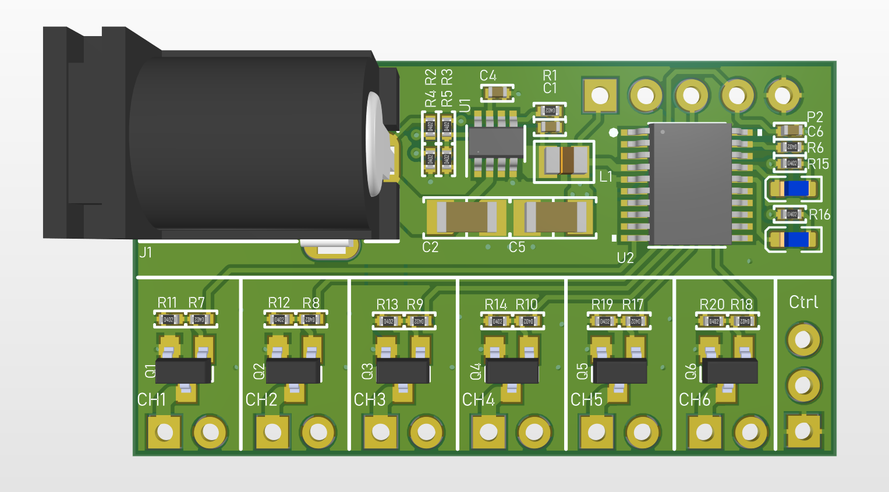

# LEDDRV_001

Simple 6ch. low side switch board.

  

## 🛠️ Hardware Info.
- **MCU**: STM32G030F6P6
- **No. of Ch.**: 6
- **Input Voltage range**: 10V ~ 20V
- **Drive Current**: Max 1A / Ch.
- **Control port**: GPIO (can be configured to UART port)

## 🧑‍💻 Software Info.
- **IDE**: STM32CubeIDE (CubeMX HAL)